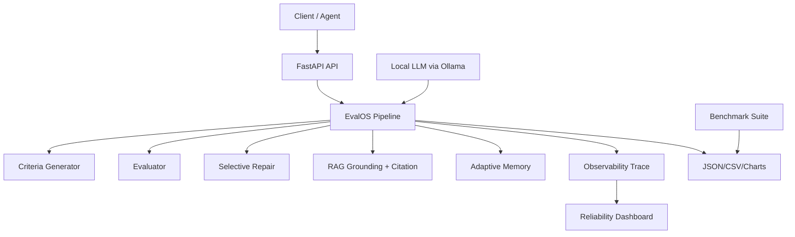

# EvalOS Architecture

```mermaid
graph TD
  User[Client / Agent] --> API[FastAPI API]
  API --> Pipeline[EvalOS Pipeline]
  Pipeline --> Criteria[Criteria Generator]
  Pipeline --> Eval[Evaluator]
  Pipeline --> Repair[Selective Repair]
  Pipeline --> Rag[RAG Grounding + Citation]
  Pipeline --> Memory[Adaptive Memory]
  Pipeline --> Trace[Observability Trace]
  Provider[Local LLM via Ollama] --> Pipeline
  Trace --> Dashboard[Reliability Dashboard]
  Bench[Benchmark Suite] --> Reports[JSON/CSV/Charts]
  Pipeline --> Reports
```

EvalOS orchestrates generation, evaluation, selective repair, and observability in a single runtime, backed by local or hosted LLM providers.
